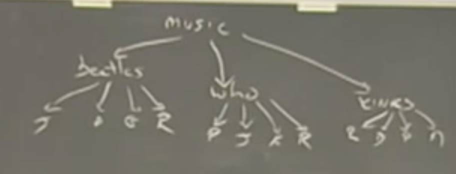

- [x] [Lecture 13](https://archive.org/details/ucberkeley_webcast_kbqJ3UGPgOc)

* `deep-map` on different tree structures
* Two recursive calls performed => *tree recursion*
  * `count-change` as an *implicit* tree-like control structure (23:00)

**Tree traversal**

Given a tree like this:



Print out the datum on every line. There are two ways.

**Depth first**

```scm
(define (depth-first-search tree)
  (display (datum tree))
  (for-each depth-first-search (children tree)))
```

**Breadth first**

> Requires auxilary `queue` structure

```scm
(define (breadth-first-search tree)
  (bfs-iter (list tree)))

(define (bfs-iter queue)
  (if (null? queue)
      'done
      (let ((task (car queue)))
        (display (datum task))
        (bfs-iter (append (cdr queue) (children task))))))
```

